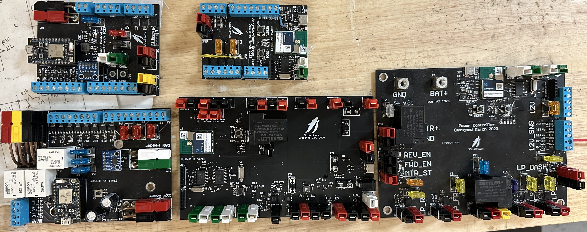
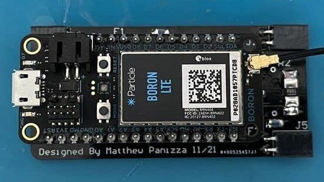

# Hey there, I'm Matthew Panizza 👋
**An Embedded Software Engineer with a passion for automotive electronics**

I enjoy brainstorming new ways of using microcontollers and automating things in my life. I then like to take that idea and develop something all the way from a rough sketch to a fully-functional prototype with user interfaces, 3D printers, and sometimes mobile apps. Reverse-engineering is also a lot of fun - I've reverse-engineered electric skateboard batteries, car instrument clusters and a host of other electronics.

|  
                                                                                                        | 
Languages I've Used
 | 

                                                                                                        | 
Tools I've Used
 |   
| :------------------------------------------------------------------------------------------------------------------------------: | :------------------------------------------------- | :-----------------------------------------------------------------------------------------------------------------------------------: | :--------------------------------------------- |  
|     | **C++**                                            |                                                             | **Particle Microcontrollers**                  | 
|     | **C**                                              |   | **Arduino Microcontrollers**                   | 
|     | **Python**                                         |                                | **PyCharm**                                    |
|     | **C#**                                             |          | **Visual Studio Code**                         |
|     | **Swift**                                          |          | **Xcode**                                      |

## Projects to Check Out
### [Decentralized Low Voltage System](https://github.com/matthewpanizza/DecentralizedLV-Boards)
A system of embedded microcontrollers that relays electrical information from the driver to accessory components over CAN Bus. Replaces large accessory wiring harnesses with a four wire (two power + two CAN) system.
- [DecentralizedLV-Boards](https://github.com/matthewpanizza/DecentralizedLV-Boards) - Submodule used as an API for inter-board communication and a platform-agnostic CAN controller.
- [DecentralizedLV-DashController](https://github.com/matthewpanizza/DecentralizedLV-DashController) - Board which takes input from the driver and controls lights, drive mode, and instrument cluster.
- [DecentralizedLV-LPDRV](https://github.com/matthewpanizza/DecentralizedLV-LPDRV) - Low Power Driver board which drives lights, pumps, and other accessories based on CAN data.
- [DecentralizedLV-ULPDRV](https://github.com/matthewpanizza/DecentralizedLV-ULPDRV) - Ultra Low Power Driver board, a miniature LPDRV with pin passthroughs for SPI and UART peripherals.
- [DecentralizedLV-HVController](https://github.com/matthewpanizza/DecentralizedLV-HVController) - High Voltage Controller board which handles the battery management system and motor inverter.
- [DecentralizedLV-Sense](https://github.com/matthewpanizza/DecentralizedLV-Sense) - Sensor board. A legacy version of the Dashboard Controller with slightly less functionality.

### [Boosted Unbrick Firmware](https://github.com/matthewpanizza/BoostedUnbrickFirmware)
Custom firmware for a Microchip dsPIC33 to interface with all components on the PCB of a Boosted Extended Range Battery (XRB). This custom firmware helped me restore functionality to a XRB which had a software lockout after the Li-ion cells became imbalanced.

### [CAN Bus Analyzer](https://github.com/matthewpanizza/CANAnalyzer)
A tool for analyzing received CAN Bus frames and emulating CAN Bus messages. Complex loops over different combinations of addresses and data bytes can be done using a serial console. This tool was used to determine the CAN Bus messaging system used for a 2018 Toyota Camry Instrument Cluster which is included in the [DecentralizedLV-Boards API](https://github.com/matthewpanizza/DecentralizedLV-Boards) and controlled by the [DecentralizedLV-DashController](https://github.com/matthewpanizza/DecentralizedLV-DashController) board.

### [SkateInfoView](https://github.com/matthewpanizza/SkateInfoView)
An iOS app paired with a Bluetooth Low Energy (BLE) microcontroller which monitors power usage on an electric skateboard. The microcontroller reads voltage, current, speed and other parameters and relays them over BLE to a companion app on an iPhone. There is also an Apple Watch companion app which received relayed information from the iPhone.

